# Match Reservation System

<div name="header" align="center">

</a>

   </div>
<p align="center">
  <a href="" rel="noopener">
</p>
<p align="center">  Match Reservation System
    <br> 
</p>
<div align="center">
  
[](https://github.com/gaserashraf/Match-Reservation-System/contributors)
[](https://github.com/gaserashraf/Match-Reservation-System/issues)
[](https://github.com/gaserashraf/Match-Reservation-System/network)
[](https://github.com/gaserashraf/Match-Reservation-System/stargazers)
[](https://github.com/CMPLR-Technologies/Match-Reservation-System/blob/master/LICENSE)

</div>

## 📝 Table of Contents

- [About](#about)
- [Get started](#Install)
- [Technology](#tech)
- [Screenshots](#Screenshots)

## 📙 About <a name = "about"></a>

An online automated ticket reservation system for football matches in FIFA
World Cup Qatar 2022

## 🏁 Get Started <a name = "Install"></a>

1. **Clone the repository**

```
https://github.com/gaserashraf/Match-Reservation-System.git
```

```
cd Match-Reservation-System
```

```
cd frontend
```

2. **Running**

```
npm i
```

```
npm start
```

go to your browser and go to http://localhost:5000/

## 💻 Built Using <a name = "tech"></a>

- **React.js**
- **PHP**
- **Laravel**
- **Bootstrap**

## 📷 Demo Screenshots

<div name="Screenshots" align="center">
   </a>
    <h2 align='left'>Admin role</h2>
    <h3 align='left'>users</h3>
    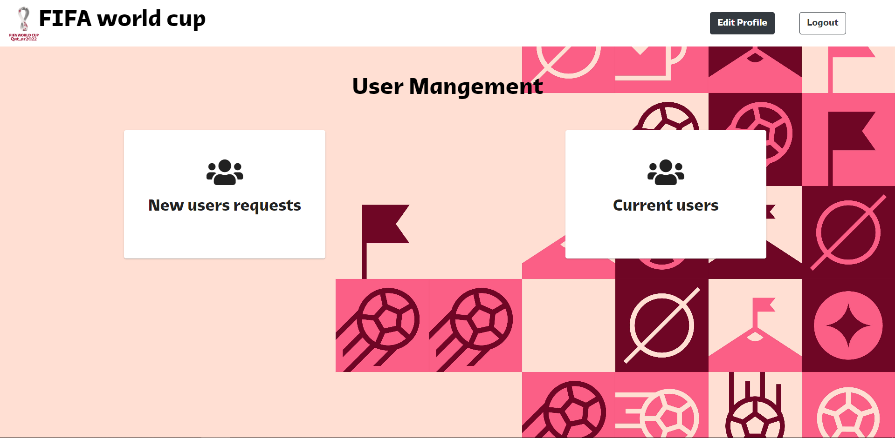</a>
    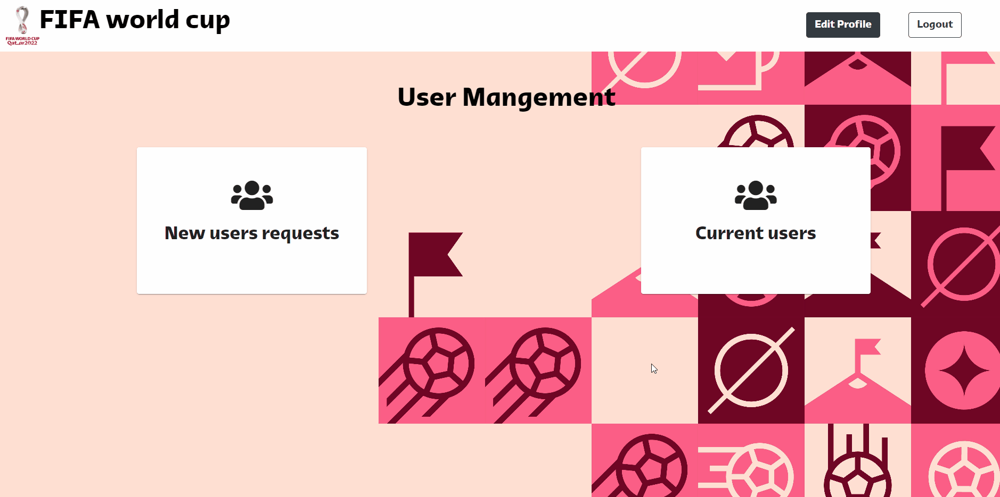</a>
   <hr>
    <h2 align='left'>Manager role</h2>
    <h3 align='left'>Stadiums</h3>
    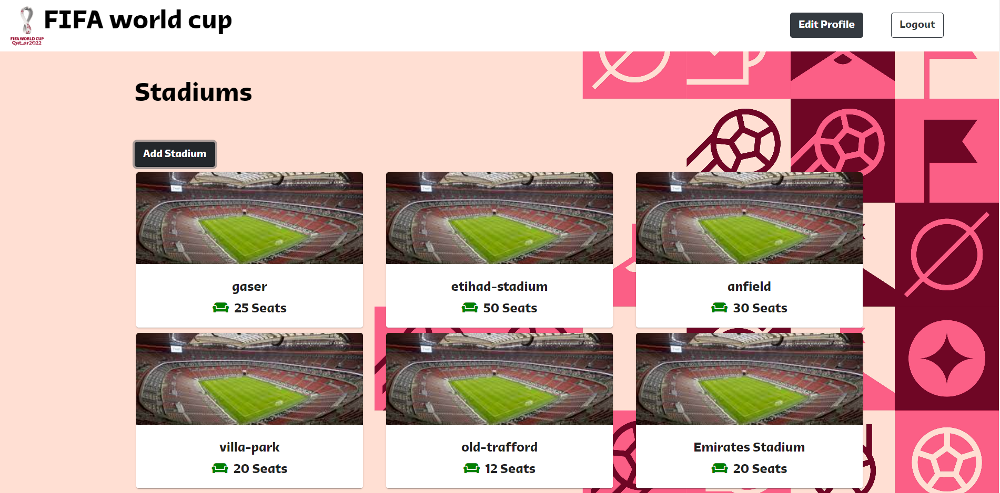</a>
    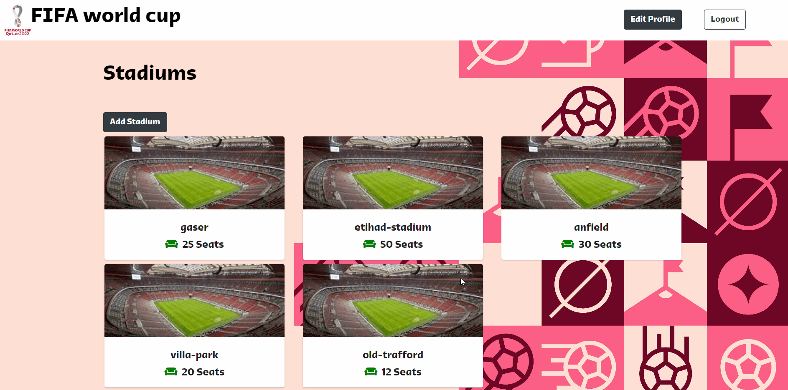</a>
   <hr>
   
   <h3 align='left'>Matches</h3>
    </a>
   <hr>
    <h2 align='left'>Customer role</h2>
    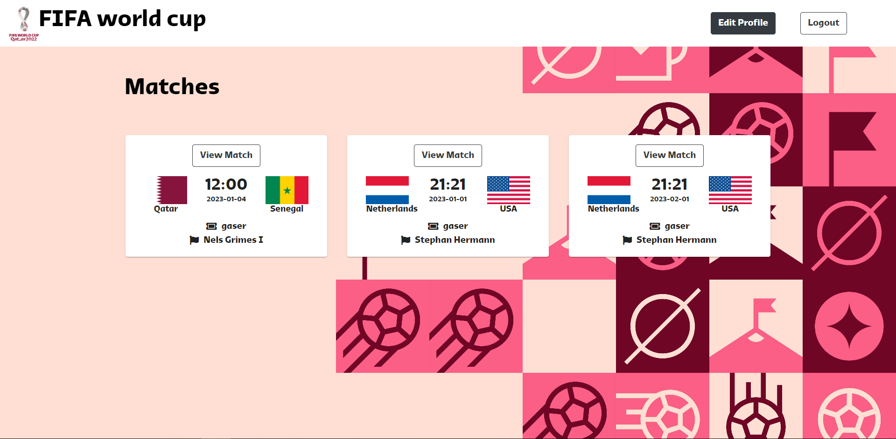</a>
    <h3 align='left'>Match page</h3>
    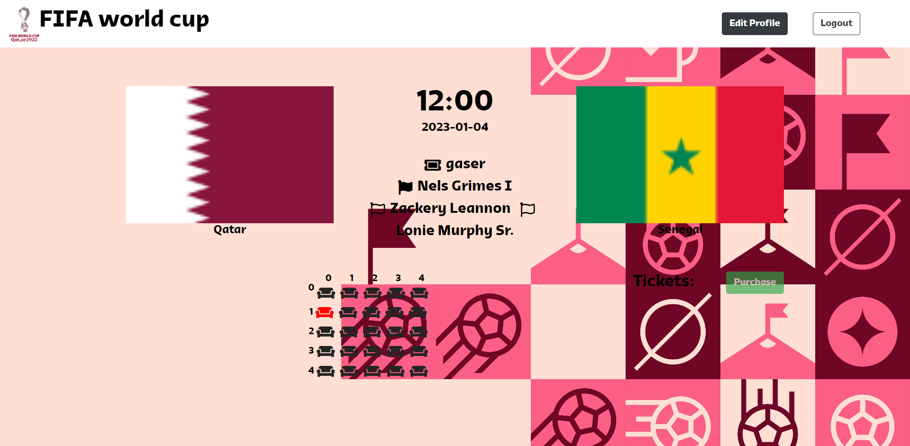</a>
     <h3 align='left'>Buy a ticket</h3>
    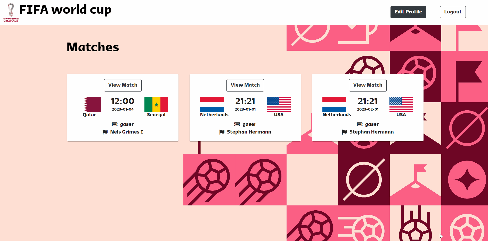</a>
    <h3 align='left'>cancel a ticket</h3>
    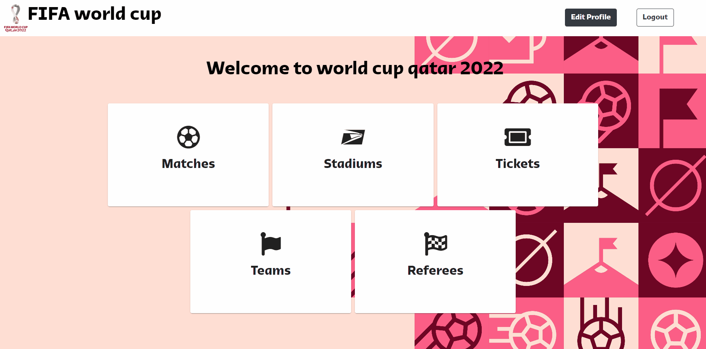</a>
   <hr>
    <h3 align='left'>Update profile</h3>
    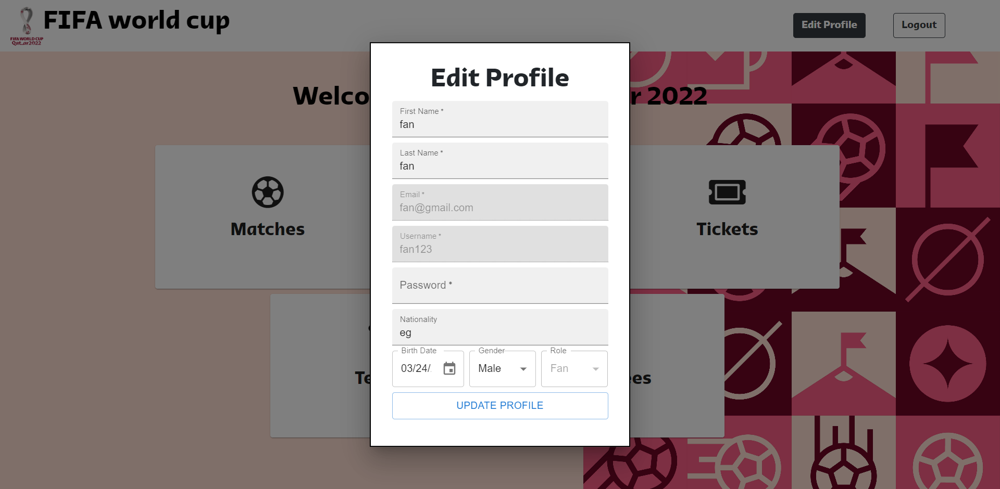</a>
    <hr>
    <h3 align='left'>Signup & Login</h3>
    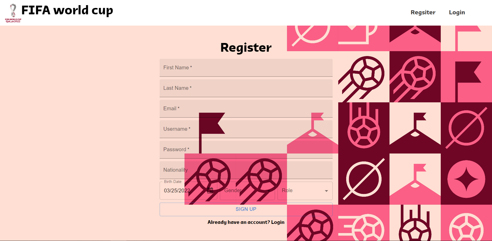</a>
    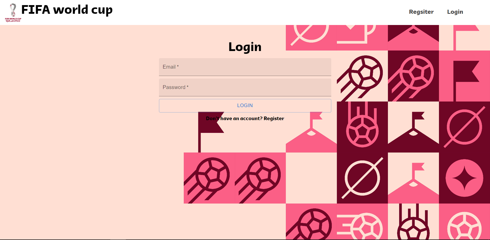</a>
    <hr>
    <h3 align='left'>fully responsive</h3>
    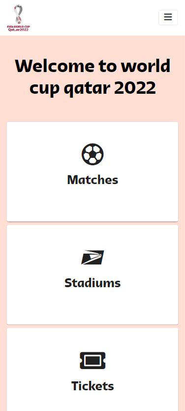</a>
    </a>
</div>
